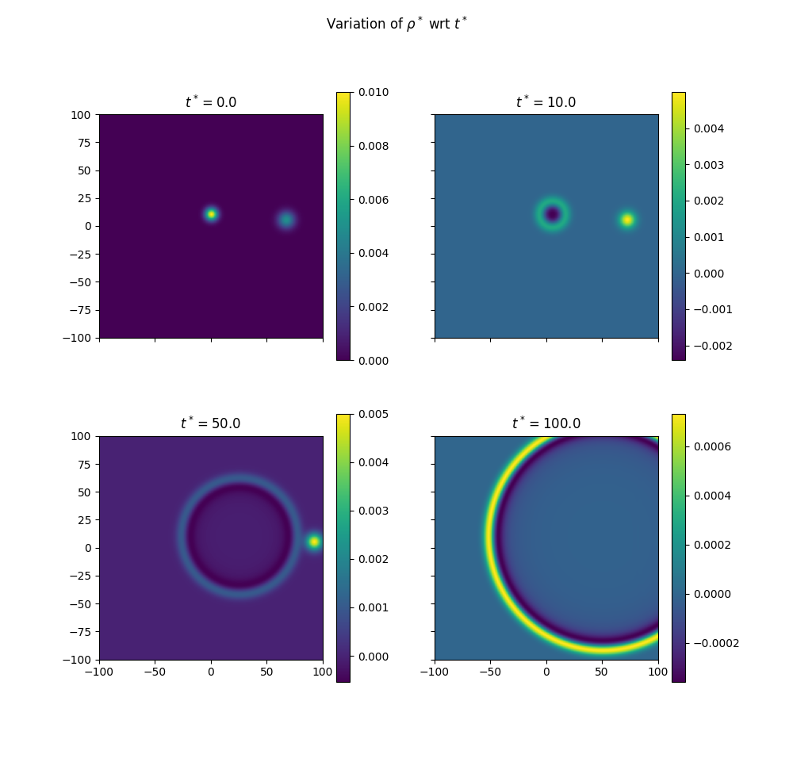
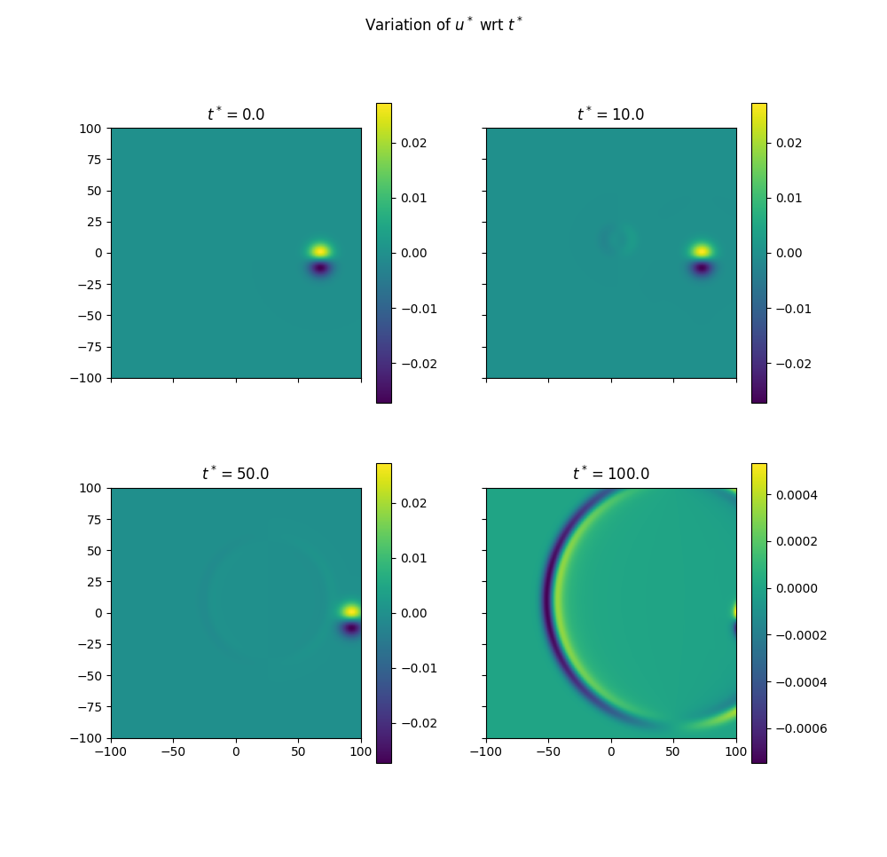
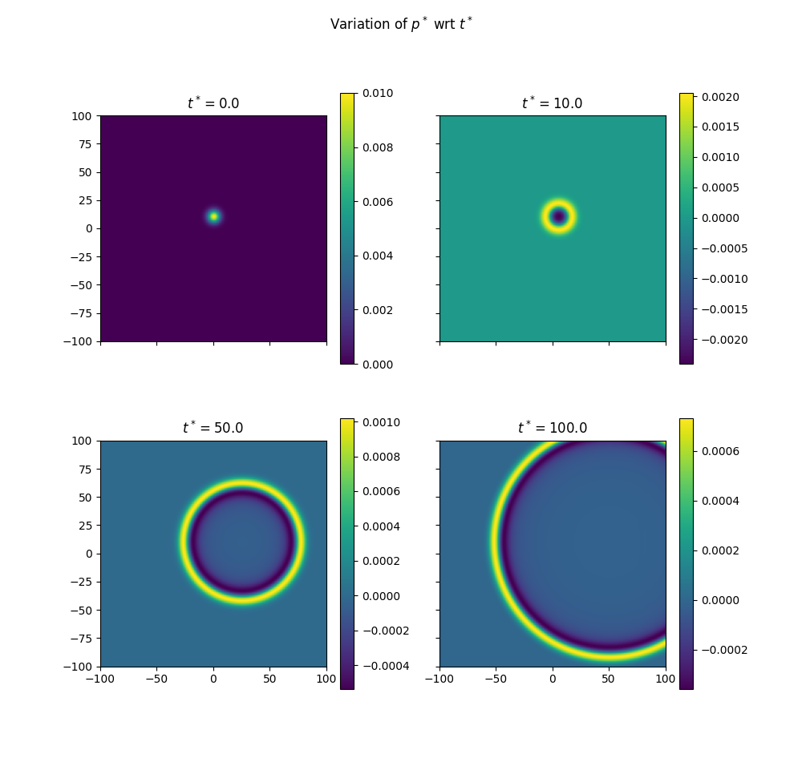

# Table of Contents

1.  [Discussion](#orgb7a106e)
    1.  [Problem Statement](#org9185077)
    2.  [Results](#orgcea4849)

# Discussion

This code allows us to simulate 2D linearised Euler Equation for acoustic perturbations. Most of the operations have been vectorised allowing faster executions.

## Problem Statement

Solving non dimensional 2D LEE

\[
\frac{\partial \underline{U^{*}}}{\partial t^{*}}+\frac{\partial \underline{E}^{*}}{\partial x^{*}}+\frac{\partial \underline{F}^{*}}{\partial y^{*}}=0, \quad \underline{U}:=\left[\begin{array}{c}
\rho^{*} \\
u^{*} \\
v^{*} \\
p^{*}
\end{array}\right], \quad \underline{E}:=\left[\begin{array}{c}
M_{x} \rho^{*}+u^{*} \\
M_{x} u^{*}+p^{*} \\
M_{x} v^{*} \\
M_{x} p^{*}+u^{*}
\end{array}\right], \quad \underline{F}:=\left[\begin{array}{c}
v^{*} \\
0 \\
p^{*} \\
v^{*}
\end{array}\right]
\]

With initial conditions,

\(\begin{aligned} \rho^{*}\left(x^{*}, y^{*}, t=0\right)=& \varepsilon_{a} \exp \left[-\alpha_{a}\left\{\left(x^{*}-x_{a}^{*}\right)^{2}+\left(y^{*}-y_{a}^{*}\right)^{2}\right\}\right] \\ &+\varepsilon_{e} \exp \left[-\alpha_{e}\left\{\left(x^{*}-x_{e}^{*}\right)^{2}+\left(y^{*}-y_{e}^{*}\right)^{2}\right\}\right] \\ u^{*}\left(x^{*}, y^{*}, t=0\right)=& \varepsilon_{v}\left(y^{*}-y_{v}^{*}\right) \exp \left[-\alpha_{v}\left\{\left(x^{*}-x_{v}^{*}\right)^{2}+\left(y^{*}-y_{v}^{*}\right)^{2}\right\}\right] \\ v^{*}\left(x^{*}, y^{*}, t=0\right)=&-\varepsilon_{v}\left(x^{*}-x_{v}^{*}\right) \exp \left[-\alpha_{v}\left\{\left(x^{*}-x_{v}^{*}\right)^{2}+\left(y^{*}-y_{v}^{*}\right)^{2}\right\}\right], \\ p^{*}\left(x^{*}, y^{*}, t=0\right)=& \varepsilon_{a} \exp \left[-\alpha_{a}\left\{\left(x^{*}-x_{a}^{*}\right)^{2}+\left(y^{*}-y_{a}^{*}\right)^{2}\right\}\right] \end{aligned}\)

## Results

